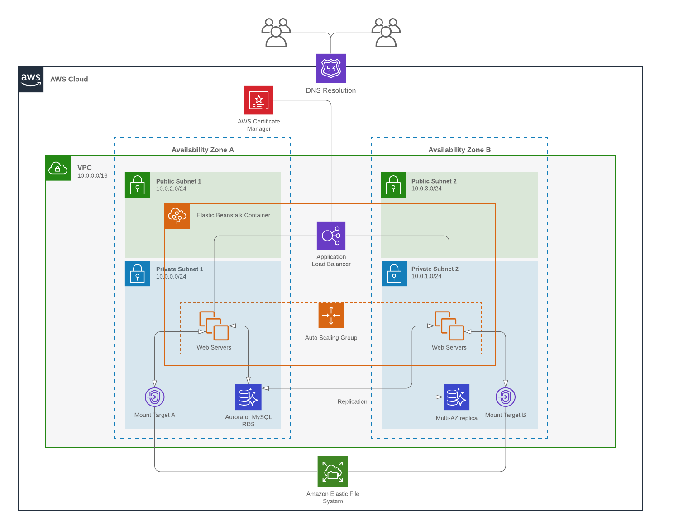

# WordPress for Elastic Beanstalk with HA on AWS

This project creates a WordPress setup designed to run with high availability on AWS's Elastic Beanstalk service. It uses EFS for storage, which means all instances share the same code and content files etc. This can cause performance issues, particularly if you ignore the performance characteristics of EFS. This project aims to avoid those pitfalls with a comprehensive multi-layer caching strategy.

The following caching strategies are implemented on the instances to minimise the I/O on the EFS volume:

* Opcache - caches compiled PHP code (configured by default on php 7+)
* FSCached - caches the EFS files on the local EBS volume
* WP Super Cache - WordPress plugin that stores rendered pages in a directory on the instance-attached EBS volume

In addition, 

* a CDN should be used to cache data at the AWS network edge for busy sites
* static content should be offloaded to S3 via a WordPress plugin

### About EFS burst credits

You should set up a CloudWatch alarm for the EFS Burst Credit metric to ensure you're warned if it ever drops unexpectedly, or below a level that can be recovered within the SLA period. 

#### Ballasting & Bursting vs Provisioned mode

If you want to guarantee burst credits don't ever bring your site to a crawl, you should look at either ballasting the EFS with large files (so it generates a higher burst credit balance) or switch it to provisioned mode, where you can specify (and pay for) a guaranteed minimum amount of throughput.

## Setting up the AWS infrastructure

Here's what we're going to build (well, almost - I'm expecting you already have the database set up. If not, you'll have to do that separately...note also you will need to have created an empty database for WordPress to write to...)



### Creating a VPC

If you don't have a VPC set up in your account yet, the vpc-privatepublic.yaml template will create one with private and public subnets that EB can use. 

The VPC template will enable the use of DNS host names and DNS resolution. This is needed to allow the EFS to be mounted. If you don't use the VPC template, please check this in your own VPC setup before proceeding.

If you don't want to use the template you can use what you have, but if you do not have private subnets with a NAT Gateway (or equivalent) you will need to enable public IPs on the EB instances when setting up the stack. This is not the recommended configuration.

### Creating the EB stack

Before you begin, make sure the following Elastic Beanstalk IAM roles have been created in your AWS account:

```
aws-elasticbeanstalk-ec2-role
aws-elasticbeanstalk-service-role
```

These will be present if you have ever created an EB application in your account in the past. If you need to create them manually, Google is your friend.

#### Creating the stack with the pre-processed template

If you are using the AWS Sydney region, and haven't modified the base template you can just use the supplied `eb-with-efs-out.yaml`. 

>_If you get an error when creating the stack you will need to regenerate the file, as stacks do get updated from time to time._

The EB deployment CF template has parameters you need to set, including names for the EB application and environment. You might use 'WordPress' for the application name and 'development' or similar for the environment name. For the solution stack, choose a recent PHP version.

There is an option to specify an ACM certification arn - if you provide this the load balancer will be configured to listen on HTTPS and the certificate you specify will be used to encrypt the connection.

You will also need to specify a key pair name. This will only be used if you allow SSH access on the instances (which in an ideal world, you won't).

#### Rebuilding the template

If you need to reprocess the template, eg to stand this up in a region other than ap-southeast-2 (Sydney) or refresh the solution stacks, you will need to reprocess the base CloudFormation template `eb-with-efs.yaml`. 

The python script `build-cf.py` will populate the EB solution stacks section with the ones available in the region your AWS CLI is configured to use (check `aws configure`, and install python & the aws cli tools if you don't have them). 

To process the base template, run

`python3 ./build-cf.py`

This will overwrite the file called `eb-with-efs-out.yaml` in the cf-templates directory. 

#### Troubleshooting

If the CloudFormation build process gets to the point where it spawns the Elastic Beanstalk environment creation and then mysteriously times out, it's _probably_ a networking issue causing your instances to be unable to register with EB. Check that your instances are in a subnet that allows them to communicate out to the Internet (ie your private subnet has a working NAT Gateway/instance, or your instances have a public IP if they are in a public subnet).

### Building the app bundle

To build the application bundle you can deploy to EB, just run

```
zip --symlinks -r wordpress_ha_on_aws.zip . --exclude='*.git*' --exclude='*.md' --exclude='*cf-templates*' --exclude=.DS_Store 
```

This will write a zip archive you can upload directly via the EB console. Note that it includes the symlink in the archive - this is necessary to map the EFS to the location EB will run your app from.

**NOTE:** Windows Zip will probably not work to achieve this step. Please use the [Linux subsystem for Windows](https://docs.microsoft.com/en-us/windows/wsl/install-win10). If you see an error in Elastic Beanstalk that says "Following services are not running: proxy", it's because your zip file is missing the symlink, which means the app server won't be able to find the app code.

### Configure the Database

This guide assumes you have an existing database instance you are going to use. Before you will be able to  install WordPress you will need to 

1. Know the database DNS endpoint 
2. Know the username and password you will use
3. Have created a database for this site and know its name, and have checked that the connection details work, the user has access to write to the db etc.
4. Enable (via security groups) the EB instances to access the database. You can do this by adding inbound access to the db for the EB instances security group (which will be created by CF and appear as `InstanceSecurityGroupName` in its outputs).

### Configuring WordPress

Once your zip archive is running on EB you can navigate to the EB URL and you should be prompted to install WordPress. Enter the site and database details as needed.

Once WordPress is installed, install the WP Super Cache plugin and configure it to use this directory for the cache:

```
/var/www/wpcache
```

### Updating WordPress

As every instance is using the same filesystem, any instance you end up on should be able to run updates, installs, file uploads etc. 

You will not be able to access any of the servers directly through FTP or SFTP.

If you need to access the filesystem on the EFS, you can install a "file manager" plugin in WordPress, should that be deemed necessary. 

### Rebuilding the EB Environment

Note if you rebuild the EB environment your endpoint URL will change and this will make your WP site break, unless you have already configured it to use something other than the default EB hostname. If this happens you should update the BASE_URL environment variable to the updated value. If content on the site is using the old URL you will need to log into the wp-admin console and install a Search and Replace plugin to fix that, or modify it via the db directly. Google is your friend.

### Asynchronous activities in WordPress (eg installs, uploads, updates)

It may be beneficial to configure sticky sessions on the load balancer (you can do this via the EB console), if asynchronous transactions (particularly in the admin console) appear to fail. This could happen if the back end is being polled for an update about a task, eg an update or install, and there is more than one instance running in the load balanced pool. Often the transaction will have succeeded, but will report a failure as the polling hit a different instance to the one doing the task.

### About auto-scaling and performance

You may need to adjust the auto-scaling settings to suit your needs, as well as ensure that your database is sufficiently well resourced to serve the traffic your site attracts. I have tested this architecture with this AWS Load Testing tool that you can also spin up in your own account - https://aws.amazon.com/solutions/distributed-load-testing-on-aws/. Note that if you see a lot of 5XX errors when you put load on your environment it probably indicates that your instances and/or db are insufficiently resourced to meet that demand (the load balancer is not getting a timely response from an EC2 instance so the request is timing out). Try scaling up your EC2 instance type, start with a minimum of 2 instances, and check your database metrics for evidence of high CPU load.

## Contributing

If you find anything here that needs fixing, or if you have improvements, please fork, fix and submit a pull request, or drop me a line if you have any questions. Thanks.

## Conclusion

The above should have you up and running with a WordPress instance that you can easily scale horizontally using the simple auto-scaling tools in Elastic Beanstalk's console, yet still manage via the WP admin console.

